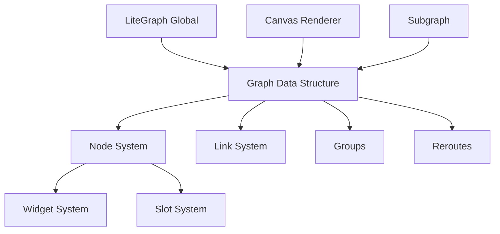
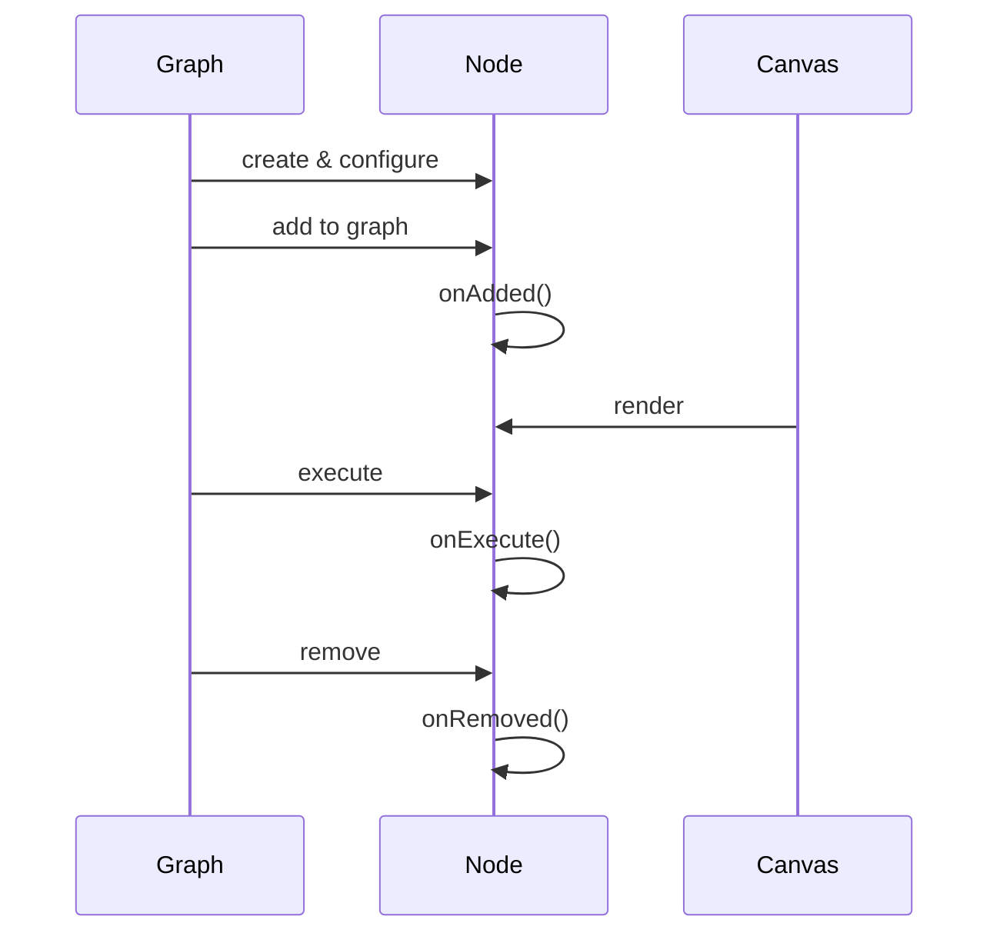
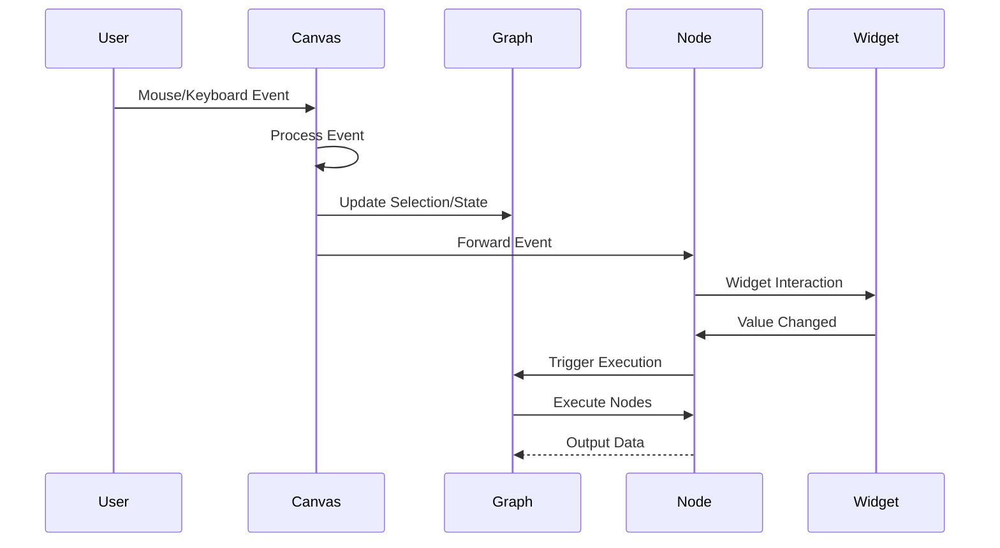

# Litegraph Architecture Overview

## Introduction

Litegraph.js is a TypeScript library for creating node-based visual programming interfaces in web browsers. This document provides a comprehensive technical overview of the architecture, combining insights from the codebase analysis and documentation.

## Core Architecture

### System Overview



### Key Components

#### 1. **LiteGraphGlobal** (`src/LiteGraphGlobal.ts`)
The global singleton that manages:
- Node type registration and factory methods
- Global configuration constants (colors, sizes, shapes)
- Utility functions and helpers
- Default values for visual elements

Key features:
- Node type registry for extensibility
- Theme configuration
- Global constants for UI consistency
- Event system configuration

#### 2. **LGraph** (`src/LGraph.ts`)
The core graph data structure that:
- Manages nodes, links, groups, and reroutes
- Controls execution flow and graph state
- Handles serialization/deserialization
- Tracks graph revision and state changes

Key properties:
- `_nodes`: Array of nodes in the graph
- `links`: Map of link IDs to LLink objects
- `reroutes`: Map of reroute IDs to Reroute objects
- `state`: Tracks last IDs for nodes, links, groups, reroutes
- `status`: Running/stopped state
- `extra`: Extensible metadata storage

#### 3. **LGraphNode** (`src/LGraphNode.ts`)
The fundamental building blocks that:
- Contain inputs, outputs, properties, and widgets
- Implement execution logic via `onExecute()`
- Support custom rendering and interactions
- Handle connections and data flow

Node lifecycle:


#### 4. **LGraphCanvas** (`src/LGraphCanvas.ts`)
The visualization and interaction layer that:
- Renders graphs using Canvas 2D API
- Manages user interactions (mouse, keyboard)
- Handles zoom, pan, and selection
- Provides context menus and search functionality
- Implements drag & drop operations

Key features:
- DragAndScale for viewport manipulation
- Event handling system
- Rendering optimizations
- Widget interaction handling
- Link drawing and manipulation

#### 5. **Link System** (`src/LLink.ts`, `src/canvas/`)
Manages connections between nodes:
- **LLink**: Core link data structure
- **LinkConnector**: Handles link dragging and creation
- **RenderLink** classes: Different link rendering strategies
- **FloatingLinks**: Temporary links during connection

Link types:
- Standard links between node slots
- Reroute links for organization
- Floating links during drag operations

#### 6. **Slot System** (`src/node/`)
Node connection points:
- **NodeInputSlot**: Receives data from links
- **NodeOutputSlot**: Sends data through links
- **SlotBase**: Common slot functionality
- Type checking and validation
- Visual representation configuration

#### 7. **Widget System** (`src/widgets/`)
Interactive controls within nodes:
- **BaseWidget**: Abstract base class
- **NumberWidget**: Numeric inputs with validation
- **SliderWidget**: Range-based numeric input
- **ComboWidget**: Dropdown selections
- **TextWidget**: Text input fields
- **BooleanWidget**: Checkboxes
- **ButtonWidget**: Clickable actions

Widget features:
- Value binding and callbacks
- Custom rendering
- Mouse interaction handling
- Serialization support

#### 8. **Subgraph System** (`src/subgraph/`)
Nested graph functionality:
- **Subgraph**: Container for nested graphs
- **SubgraphInput/OutputNode**: Interface nodes
- Hierarchical graph composition
- Input/output mapping
- Widget exposure to parent graph

## Event Flow and Execution

### Event System



### Execution Model

1. **Topological Sorting**: Nodes are sorted based on dependencies
2. **Execution Order**: Nodes execute in dependency order
3. **Data Flow**: Values propagate through links
4. **Event Modes**:
   - `ALWAYS`: Execute continuously
   - `ON_EVENT`: Execute on input change
   - `NEVER`: Manual execution only
   - `ON_TRIGGER`: Execute on trigger signal
   - `BYPASS`: Skip execution

## Rendering System

### Canvas Rendering Pipeline

1. **Clear & Setup**: Prepare canvas context
2. **Background**: Grid and background elements
3. **Groups**: Render group boundaries
4. **Links**: Draw connections with appropriate styles
5. **Reroutes**: Render reroute points
6. **Nodes**: Draw node bodies, titles, slots, widgets
7. **Overlays**: Selection boxes, tooltips, menus

### Rendering Optimizations

- **Viewport Culling**: Only render visible items
- **Dirty Rectangles**: Partial redraws when possible
- **Level of Detail**: Simplified rendering when zoomed out
- **Cached Paths**: Reuse Path2D objects for links

## Type System and Interfaces

### Core Interfaces

- **Positionable**: Items that can be positioned and selected
- **HasBoundingRect**: Items with spatial bounds
- **LinkNetwork**: Contains links and reroutes
- **Serialisable**: Objects that can be saved/loaded
- **IColorable**: Items that support color customization

### Serialization Format

```typescript
interface SerialisableGraph {
  version: number
  state: LGraphState
  nodes: ISerialisedNode[]
  links: SerialisableLink[]
  groups: SerialisableGroup[]
  extra: LGraphExtra
}
```

## Extension Points

### Custom Node Types

```typescript
class MyCustomNode extends LGraphNode {
  title = "My Node"
  
  constructor() {
    super()
    this.addInput("in", "number")
    this.addOutput("out", "number")
    this.addWidget("number", "value", 1)
  }
  
  onExecute() {
    const input = this.getInputData(0) ?? 0
    const multiplier = this.widgets[0].value
    this.setOutputData(0, input * multiplier)
  }
}

LiteGraph.registerNodeType("custom/multiply", MyCustomNode)
```

### Custom Widgets

```typescript
class MyWidget extends BaseWidget {
  draw(ctx: CanvasRenderingContext2D, node: LGraphNode, 
       widgetWidth: number, posY: number, height: number) {
    // Custom rendering logic
  }
  
  mouse(event: CanvasPointerEvent, pos: Point, node: LGraphNode): boolean {
    // Handle interaction
    return true // consumed event
  }
}
```

## Memory Management

- **Object Pooling**: Reuse of common objects
- **Weak References**: For optional associations
- **Event Cleanup**: Proper listener removal
- **Resource Disposal**: Canvas and DOM cleanup

## Performance Considerations

1. **Node Limits**: MAX_NUMBER_OF_NODES = 10,000
2. **Render Batching**: Group similar operations
3. **Event Throttling**: Limit high-frequency updates
4. **Lazy Evaluation**: Compute only when needed
5. **Spatial Indexing**: Efficient item lookup by position

## Best Practices

1. **Node Design**:
   - Keep execution logic lightweight
   - Validate inputs before processing
   - Handle undefined/null gracefully
   - Use appropriate slot types

2. **Graph Construction**:
   - Organize with groups and reroutes
   - Minimize crossing links
   - Use subgraphs for complexity
   - Label nodes and groups clearly

3. **Performance**:
   - Limit widget updates during execution
   - Use appropriate execution modes
   - Profile heavy computations
   - Consider web workers for intensive tasks

## Future Considerations

- WebGL rendering backend
- Improved touch support
- Enhanced subgraph capabilities
- Extended serialization formats
- Plugin architecture improvements

## Conclusion

Litegraph provides a robust foundation for node-based visual programming with:
- Flexible architecture supporting extension
- Comprehensive type system
- Efficient rendering pipeline
- Rich interaction model
- Proven scalability to complex graphs

The modular design allows for customization while maintaining performance and usability across diverse applications.